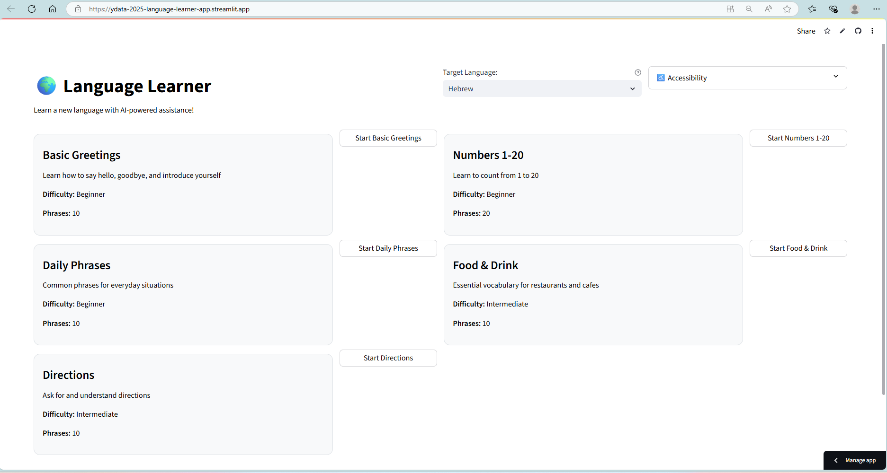
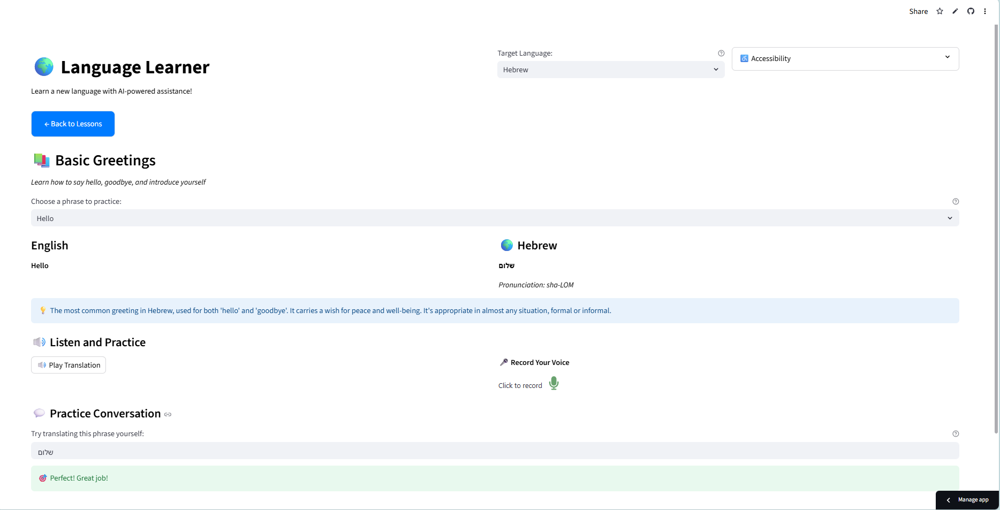

# Language Learner - AI-Powered Language Learning App

Learn a new language with the help of Google's Gemini AI! This Streamlit application provides an interactive, accessible way to learn languages through structured lessons and real-time translations.

**Story behind our app**
  * Many people want to learn a new language but lack interactive tools that are easy to use, especially for elderly users or those with disabilities. Existing apps often focus on reading/writing words without sufficient support for speaking practice. Our app aims to provide an audio-based chatbot to help users learn and practice spoken language in real time.
  * Maybe you can also learn some local phrases before your next personal or work trip, so that you can speak confidently!


**Flowchart**
```
User Selects a Practice
     ↓
User Selects an English Word
     ↓
Gemma API: Language Translation and Guidance
Google Text to Speech API: Text to Speech
     ↓
Streamlit UI: Translated Word + Pronunciation Guide + Usage Guide + Audio Playback
     ↓
User Understands the Translation
     ↓
User Practices Audio Response
     ↓
User Practices Written Word Response
     ↓
FuzzyWuzzy: Feedback on Word Response
     ↓
Repeat the Cycle / Move on to the Next Lesson
```


## Features
- **13 Supported Languages**: Hebrew, Finnish, French, German, Spanish, Italian, Portuguese, Japanese, Korean, Hindi, Arabic, Bahasa Melayu, Chinese (Mandarin)
- **Structured Curriculum**: Progressive lessons from basic greetings to intermediate conversations
- **Real-time Translation**: Powered by Gemma and Google Text to Speech APIs
- **Pronunciation Guides**: Phonetic pronunciation for every phrase
- **Interactive Practice**: Test your knowledge with instant feedback
- **Accessibility First**: 
  - Large, easy-to-click buttons
  - Adjustable font sizes
  - Dark mode support
  - Keyboard navigation
  - Screen reader friendly


## Screenshots

### Main Lesson Selection
- Choose from beginner and intermediate lessons
- See phrase counts for each lesson


### Practice Interface
- Real-time translations
- Pronunciation guides
- Interactive practice with feedback



## Quick Start

1. **Clone the repository**
   ```bash
   git clone https://github.com/KaiquanMah/language-learner.git
   cd language-learner
   ```

2. **Install system packages**
    - Streamlit Community Cloud users
      - No action required. Streamlit Community Cloud installs 'portaudio19-dev' specified in packages.txt
    - Linux users
      ```bash
      sudo apt update
      sudo apt install portaudio19-dev
      ```
    - macOS users
      ```bash
      brew install portaudio
      ```
    - Windows users
      - No action required. PyAudio wheels come bundled with PortAudio during pip install

3. **Install dependencies**
   ```bash
   pip install -r requirements.txt
   ```

4. **Set up your Gemini API key**
   - Get a free API key from [Google AI Studio](https://makersuite.google.com/app/apikey)
   - Create a `.env` file in the project root:
     ```
     GEMINI_API_KEY = "your_api_key_here"
     ```

5. **Run the app**
   ```bash
   streamlit run streamlit_app.py
   ```


## Deployment on Streamlit Community Cloud

1. **Fork this repository** to your GitHub account

2. **Create a Streamlit account** at [streamlit.io](https://streamlit.io)

3. **Deploy the app**:
   - Click "New app" on your Streamlit dashboard
   - Connect your GitHub repository
   - Set the main file path to `streamlit_app.py`
   - Add your Gemini API key in the Secrets section:
     ```toml
     GEMINI_API_KEY = "your_api_key_here"
     ```

4. **Deploy and share** your app URL!


## Project Structure

```
language-learner/
├── archive                      # folder containing archived builds
├── artifacts                    # folder containing terminal workings, vibe code 'plan.md' and screenshots for the 'vibe-code-experience.md' assignment report
├── .env                         # API key configuration (create this yourself)
├── .gitignore                   # Git ignore file
├── README.md                    # Repo README
├── specifications.md            # This file containing the specifications
├── vibe-code-experience.md      # 1-2 page documentation of our experience using vibe coding at times during the assignment
├── packages.txt                 # System packages for Streamlit Community Cloud
├── requirements.txt             # Libraries
├── streamlit_app.py             # Full version with audio features
```


## Curriculum Overview

### Beginner Lessons
1. **Basic Greetings** - Hello, goodbye, introductions
2. **Numbers 1-20** - Learn to count
3. **Daily Phrases** - Common everyday expressions

### Intermediate Lessons
1. **Food & Drink** - Restaurant and cafe vocabulary
2. **Directions** - Asking for and giving directions


## ♿ Accessibility Features

- **Visual**:
  - Adjustable font sizes (small to extra-large)
  - High contrast mode
  - Dark/light theme toggle
  - Clear visual feedback

- **Navigation**:
  - Mouse navigation
  - Keyboard-only navigation
  - Skip links to the main content
  - Tab order optimization

- **Screen Readers**:
  - ARIA labels
  - Meaningful button text


## Limitations
* Unable to record ourselves and check for pronunciation
  * This could have helped users learn to pronounce words better
* Unable to track progress using a progress bar and dashboard
  * This would have allowed for gamification of the app


## Configuration

### Environment Variables
- `GEMINI_API_KEY`: Your Google Gemini API key (required)

### Customization
You can customize the app by modifying:
- `CURRICULUM`: Add or modify lessons
- `LANGUAGES`: Add more language options
- `apply_custom_css()`: Adjust styling

**Happy Language Learning! ✨**


