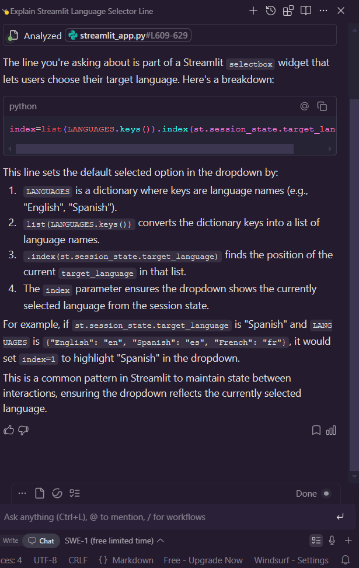
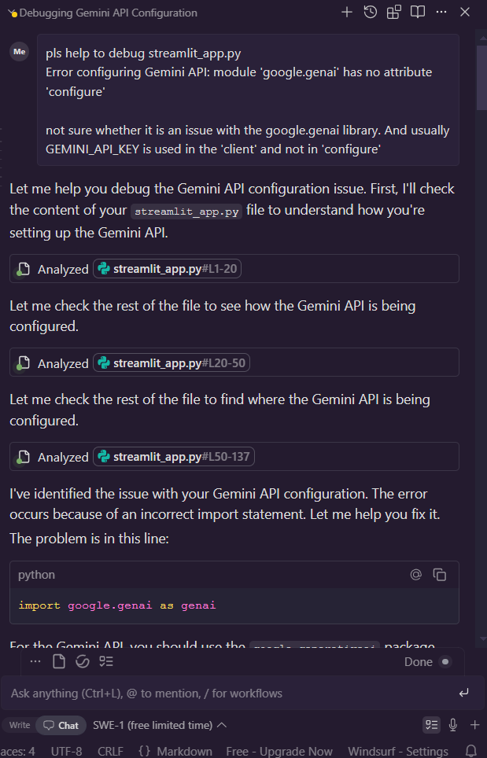
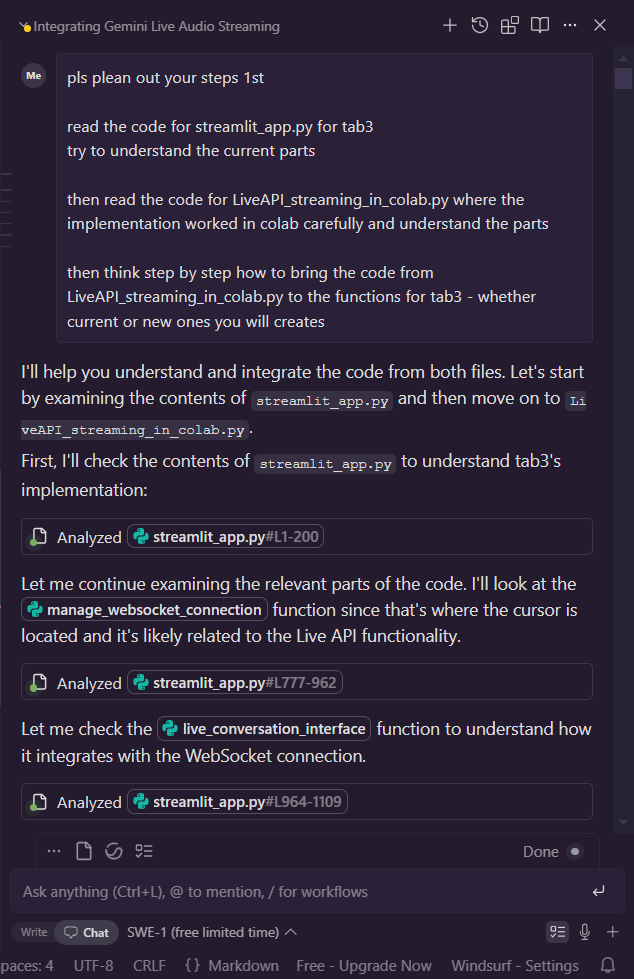
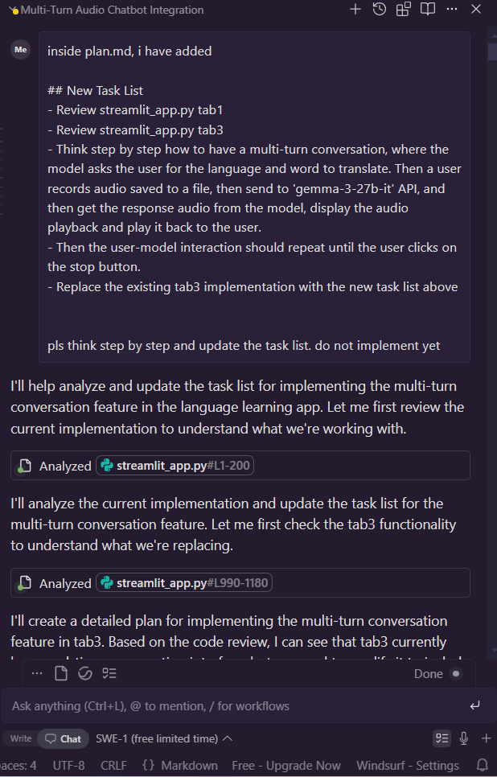
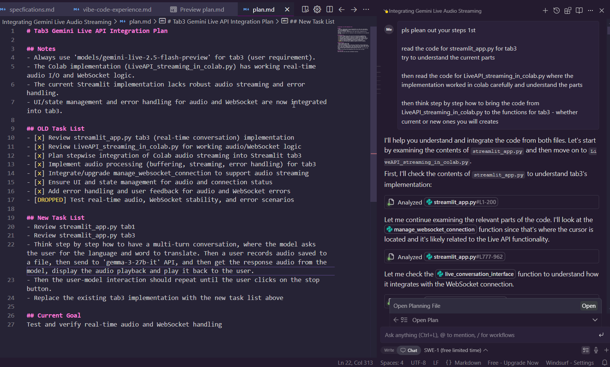

# Vibe Code Experience
Note that in each section, we will talk about the tools we used, what worked well, what did not work well, and what we learned / 'best practices' we found.

## What We Tried with Vibe Coding Tools

### Google AI Studio
* We used Google AI Studio to create an initial draft of the app after putting in our requirements. We tried this 3 times.
* Bad
    * During the initial attempt, even though we specified streamlit app and python backend as our requirements, Google AI Studio still created HTML, TS, TSX files
    * During the second and third attempts, we specified in the requirements 'DO NOT create any HTML, TSX files!' However, Google AI Studio still created HTML, TS, TSX files 
    * The Gemini Live API on the backend also misheard what I said, and output unsafe text. This is bad for user experience because as a user, I was practising my pronunciation and conversation, yet the chatbot was 'putting words in my mouth' 
* Good
    * Google AI Studio created a basic web application which allowed a user to either enter text or speak using audio with the Gemini Live API on the backend. However, because this was not a streamlit app, we scrapped this build. It is found in `archive\2025.07.15-v1-Gemini created html ts tsx files even though we asked it not to.zip`
* Lessons
    * Google AI Studio may be good to create an initial draft of a web application, to see if certain functionalities work. Subsequently, you need to use other tools to create the final product
    * Google AI Studio is not good at following instructions, even if properly documented in our input prompt to Google AI Studio
* Best Practices
    * It is important to be very explicit in your requirements, which takes iterative effort. Whether the LLM follows your requirements is a separate issue

### Gemini CLI - Create 
* Next we moved on to Gemini CLI
* We created a `artifacts\plan-v1.md` file outlining our requirements, tech stack, functionalities, user stories, and flowchart
* Then we iteratively asked Gemini CLI to create the app based on our specification
* Gemini CLI's web app was still partially developed with bugs that we iteratively tried to fix. It is found in `archive\2025.07.16-v2-from-gemini-cli-halfway.zip`
* Bad
    * Gemini CLI only allows 100 requests or interactions per day with the API. For heavy duty projects and debugging, this is not ideal
    * Gemini CLI was also prone to creating code with bugs. When we solve 1 part, the solution breaks another part. And as we iteratively solved each bug, new bugs were introduced. It was incredibly frustrating
    * Gemini CLI was bad differentiating between the ways of using various Gemini APIs, and in differentiating between how to use the old/deprecated google generativeai library and the new google genai library. It is interesting that somehow Gemini's own LLM on the backend which provides information to Gemini CLI, is not finetuned well on its own Google documentation
* Good / Best Practices
    * Gemini CLI can create a plan for what it would do. This allows a user to review then edit the plan before asking Gemini CLI to build the app
* Lessons
    * Gemini CLI is bad at debugging, and kept introducing new bugs as we fix a previous bug
    * Gemini CLI's LLM on the backend has not been finetuned on Google's own documentation, which can lead to frustrations when learning to use Gemini APIs to create apps. Because the original intention of vibe coding is to create applications easily, the lack of finetuning on Google's own documentation is a major issue to adoption of Gemini CLI for vibe coding of web apps
    * The daily limit of 100 requests per day is also another major issue to adoption of Gemini CLI for serious vibe coding

### Windsurf
* Then we moved on to using the Windsurf IDE on our laptop, which has the Cascade chat with a SWE-1 model (for software engineering) on the backend
* From a draft version of a streamlit app, we iteratively asked Windsurf to
    * explain code to us 
    * help us debug our code
        * e.g. debug google genai library 
    * help us understand our existing streamlit app code, code which works elsewhere in a colab notebook (such as in `artifacts\LiveAPI_streaming_in_colab.py`), then explore how to bring that code over to work in a streamlit app to implement a new functionality 
    * help us change our implementation of a functionality 
* Bad
    * We were trying to implement the Live API audio-to-audio functionality for multi-turn conversations to allow users to practise their speaking skills in a foreign language, and have Gemini provide feedback on a user's audio. Windsurf was debugging all the while but the solutions it gave did not solve the issue. We tried debugging over multiple days with no success. So even though the Gemini Live API functionality worked in Colab, it did not work in Streamlit, and there is not much that Windsurf could do to help
    * It is hard to find which converstion has a plan.md file, and which conversation does not have a plan.md file, for retrieval in future
* Good / Lessons
    * For simpler code such as streamlit and HTML, Windsurf can explain the code to us
    * Windsurf can also interact with us in the Cascade chat or through its own plan.md files for each chat
    * You can refer to historical conversations in the Cascade chat
* Best Practices
    * Get Windsurf to plan out its steps before it starts debugging and coding
    * Please save the plan.md file for each conversation if you wish to have a copy for easy reference in future. Otherwise you need to hunt for the plan.md files individually in each chat
        * Example plan.md file from a historical chat `artifacts\windsurf5-plan.md` 

